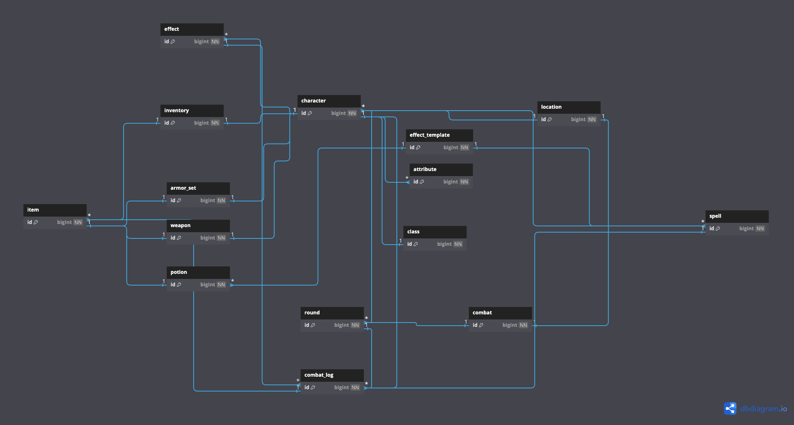
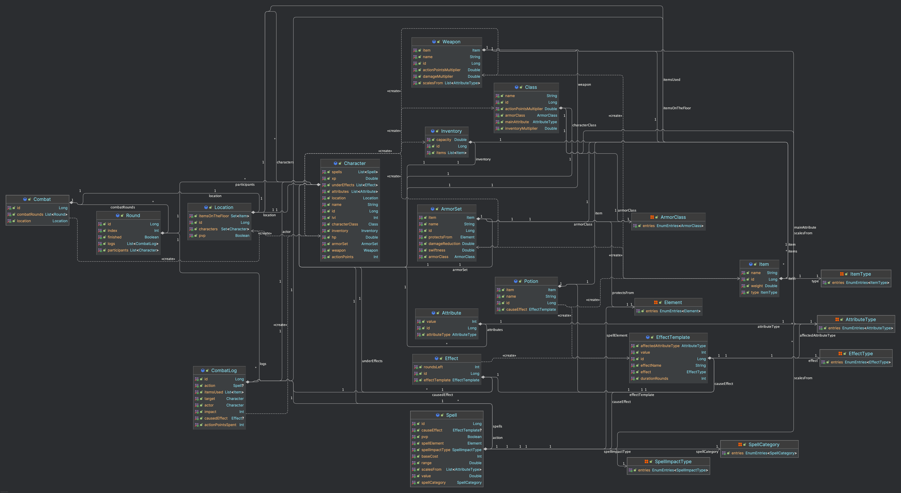
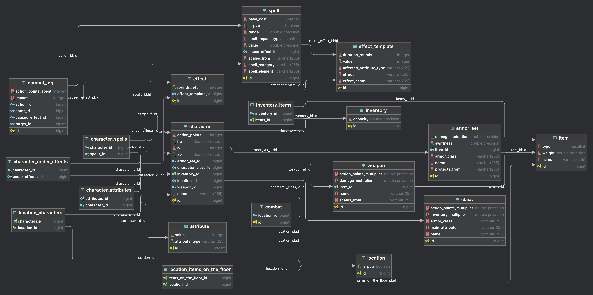

# RPG Game Project

## Game Concept

This game is set in a magical world with distinct locations (not an open world). Locations are divided into PvP and
non-PvP zones. Some spells can only be used in PvP zones, while others are restricted to non-PvP zones.

For better understanding, use this diagram


## Character System

### Attributes

The game begins with character class selection. Different classes emphasize different attributes. There are five
attributes in total:

- **STRENGTH**: Affects physical damage and certain abilities
- **INTELLIGENCE**: Affects magical abilities and action points
- **DEXTERITY**: Affects dodge chance and certain abilities
- **CONSTITUTION**: Affects inventory capacity and durability
- **HEALTH**: Affects maximum health points

Players can improve these attributes when leveling up.

### Classes

Each class has:

- A name
- A main attribute
- An armor class preference
- An inventory capacity multiplier
- An action points multiplier

## Inventory and Items System

### Inventory

Characters have an inventory to store items. The inventory capacity depends on both the character's class and their
Constitution attribute.

### Items

All items in the game are unique. Items have:

- A name
- A weight
- A type (ARMOR, WEAPON, POTION, TROPHY)

### Equipment

Characters can equip:

- **Weapons**: Directly affect damage output. Weapons have a damage multiplier, an action points multiplier, and scale
  with specific attributes.
- **Armor Sets**: Provide protection against specific elements. Armor has a damage reduction value and a swiftness value
  that affects dodge chance.
- **Potions**: Provide temporary effects when consumed.
- **Trophies**: Can be sold for resources.

## Combat System

### Action Points (AP)

Each character has action points that are used in combat. The number of AP depends on the character's Intelligence
attribute and class.

### Spells

Characters have a set of spells. Spells:

- Consume AP when cast
- Cost less AP if the character has high values in the attributes the spell scales from
- Can have an elemental type
- Can apply buffs or debuffs
- Can deal damage or heal targets
- Have a range

The damage or healing of a spell depends on the character's proficiency with the relevant attributes and their weapon.

### Elements

Each spell has an elemental type:

- FIRE
- WATER
- EARTH
- AIR
- LIGHTNING
- ICE
- POISON
- THUNDER
- PHYSICAL
- HOLY

Armor provides resistance to specific elements, reducing damage taken from spells of that element.

### Dodge Chance

The chance to completely avoid damage depends on:

- The attacker's Dexterity
- The defender's Dexterity
- The defender's armor swiftness

Higher Dexterity and lighter armor increase the chance to dodge.

### Effects (Buffs and Debuffs)

Effects can be applied by spells or potions. They can:

- Temporarily increase or decrease attributes
- Last for a specific number of rounds
- Not deal direct damage

## Locations

Players never know what location awaits them next. They might enter:

- A peaceful location with equipment on the floor
- A swamp filled with monsters

If there are no enemies in a location, peaceful spells (like Rest) can be used.

## Combat Flow

If a player enters a location with monsters, combat begins. Combat is divided into rounds, which continue until the
player wins or dies.

At the beginning of each round, all participants receive AP based on their class and attributes. During the round,
participants can use items and cast spells in any order, limited only by their AP.

If a character dies, their items are dropped on the location's floor, allowing anyone to pick them up.

## Combat Log

All combat actions in each round are recorded in a combat log, which tracks:

- The actor (who performed the action)
- The action (what spell was used)
- The target
- Any effects caused
- AP spent
- Items used
- Impact (damage dealt or healing done)

## ER-Diagram



# DnD Combat System Documentation

This document provides a comprehensive description of the magical world RPG system with its combat mechanics, character
progression, and entity relationships.

## Domain Model Overview



&nbsp;

&nbsp;
&nbsp;

&nbsp;
&nbsp;

&nbsp;&nbsp;

&nbsp;&nbsp;

&nbsp;&nbsp;

&nbsp;&nbsp;

&nbsp;&nbsp;

&nbsp;
&nbsp;&nbsp;

&nbsp;

&nbsp;&nbsp;

&nbsp;


## Logical Database Model



The system is represented by the following tables and relationships:

### Character Table

- **PK**: id (Long)
- name (String)
- actionPoints (Integer)
- hp (Double)
- xp (Double)
- lvl (Integer)
- **FK**: location_id → Location.id
- **FK**: armorSet_id → ArmorSet.id
- **FK**: weapon_id → Weapon.id
- **FK**: characterClass_id → Class.id
- **FK**: inventory_id → Inventory.id

### Class Table

- **PK**: id (Long)
- name (String)
- baseInventorySize (Integer)
- baseActionPoints (Integer)

### Attribute Table

- **PK**: id (Long)
- **FK**: character_id → Character.id
- **FK**: attributeType (String - Enumerated)
- value (Integer)

### Inventory Table

- **PK**: id (Long)
- maxSize (Integer)
- currentSize (Integer)

### Item Table

- **PK**: id (Long)
- name (String)
- weight (Double)
- **FK**: inventory_id → Inventory.id (nullable)
- **FK**: location_id → Location.id (nullable)

### Weapon Table

- **PK**: id (Long)
- damage (Double)
- **FK**: item_id → Item.id

### ArmorSet Table

- **PK**: id (Long)
- defense (Double)
- weight (Double)
- **FK**: resistantElement (String - Enumerated)
- **FK**: item_id → Item.id

### Potion Table

- **PK**: id (Long)
- name (String)
- **FK**: causeEffect_id → EffectTemplate.id
- **FK**: item_id → Item.id

### Spell Table

- **PK**: id (Long)
- baseCost (Integer)
- isPvp (Boolean)
- spellCategory (String - Enumerated)
- spellElement (String - Enumerated)
- scalesFrom (String - Comma-separated list of AttributeType values)
- spellImpactType (String - Enumerated)
- range (Double)
- value (Double)
- **FK**: causeEffect_id → EffectTemplate.id (nullable)

### Character_Spell Join Table

- **PK, FK**: character_id → Character.id
- **PK, FK**: spell_id → Spell.id

### Effect Table

- **PK**: id (Long)
- remainingRounds (Integer)
- **FK**: character_id → Character.id
- **FK**: effectTemplate_id → EffectTemplate.id

### EffectTemplate Table

- **PK**: id (Long)
- name (String)
- duration (Integer)
- **FK**: affectedAttribute (String - Enumerated)
- modifierValue (Integer)

### Location Table

- **PK**: id (Long)
- name (String)
- isPvp (Boolean)

### CombatRound Table

- **PK**: id (Long)
- roundNumber (Integer)
- **FK**: location_id → Location.id
- isActive (Boolean)

### CombatLog Table

- **PK**: id (Long)
- **FK**: actor_id → Character.id
- **FK**: action_id → Spell.id (nullable)
- **FK**: target_id → Character.id
- **FK**: causedEffect_id → Effect.id (nullable)
- actionPointsSpent (Integer)
- impact (Integer)
- **FK**: round_id → CombatRound.id

### CombatLog_Item Join Table

- **PK, FK**: combatLog_id → CombatLog.id
- **PK, FK**: item_id → Item.id

## Key Game Processes

### 1. Spell Casting During Combat

When a character casts a spell in combat, the following process occurs:

1. **Eligibility Checks**:
    - **Location Check**:
        - Read `Spell.isPvp` and `Location.isPvp`
        - If `Spell.isPvp = true` and `Location.isPvp = false`, spell casting fails

    - **Range Check**:
        - Calculate distance between `Character` positions in the `Location`
        - If distance > `Spell.range`, spell casting fails

    - **AP Check**:
        - Calculate required AP using formula:
        - 
          ```
          requiredAP = Spell.baseCost * (1 - (Character.attributeValue(Spell.scalesFrom[0]) / 100))
          ```
        - If `Character.actionPoints < requiredAP`, spell casting fails

2. **AP Deduction**:
    - Update `Character` record:
      ```
      Character.actionPoints = Character.actionPoints - requiredAP
      ```

3. **Hit Chance Calculation**:
    - Read `actor.attributes` where `attributeType = DEXTERITY` → `actorDexterity`
    - Read `target.attributes` where `attributeType = DEXTERITY` → `targetDexterity`
    - Read `target.armorSet.weight` → `armorWeight`
    - Calculate hit chance:
      ```
      hitChance = 0.5 + (actorDexterity / 100) - (targetDexterity / 150) - (armorSwiftness / 200)
      ```
    - Generate random number between 0 and 1
    - If random > hitChance, spell misses, create `CombatLog` with `impact = 0`

4. **Damage/Healing Calculation** (if hit):
    - Read `Spell.value` → `baseValue`
    - Read `actor.attributes` where `attributeType = Spell.scalesFrom[0]` → `primaryAttribute`
    - Read `actor.weapon.damage` → `weaponDamage` (if applicable)
    - Calculate impact:
      ```
      impact = baseValue * (1 + (primaryAttribute / 50)) + (weaponDamage * 0.5)
      ```

    - If `Spell.spellElement = target.armorSet.resistantElement`:
      ```
      impact = impact * 0.7 // Damage reduction for resistance
      ```

    - If `Spell.spellImpactType = HEALING`:
        - Update `target.hp = min(100, target.hp + impact)`
    - If `Spell.spellImpactType = DAMAGE`:
        - Update `target.hp = max(0, target.hp - impact)`
        - Check if `target.hp = 0` → process character death

5. **Effect Application** (if applicable):
    - If `Spell.causeEffect != null`:
        - Create new `Effect` record:
          ```
          Effect.effectTemplate = Spell.causeEffect
          Effect.character = target
          Effect.remainingRounds = EffectTemplate.duration
          ```
        - Add to `Character.underEffects`
        - Apply attribute modification to `target`:
          ```
          Attribute record = find where character_id = target.id AND attributeType = EffectTemplate.affectedAttribute
          record.value = record.value + EffectTemplate.modifierValue
          ```

6. **Combat Log Creation**:
    - Create new `CombatLog` record:
      ```
      CombatLog.actor = actor
      CombatLog.action = spell
      CombatLog.target = target
      CombatLog.causedEffect = created Effect (if any)
      CombatLog.actionPointsSpent = requiredAP
      CombatLog.impact = calculated impact
      CombatLog.round = current active CombatRound
      ```

### 2. Character Rest and Health Recovery

When a character uses the Rest spell to recover health (outside combat):

1. **Eligibility Check**:
    - Check if any active `CombatRound` exists for the character's current location
    - If `CombatRound.isActive = true`, rest fails

2. **Cast Rest Spell**:
    - Find Rest spell in `Character.spells` where `spellImpactType = HEALING` and `isPvp = false`
    - Calculate healing amount based on character's Health attribute:
      ```
      healthValue = Character.attributes where attributeType = HELATH
      healingAmount = Rest.impact * (1 + (constitutionValue / 75))
      ```
    - Update character HP:
      ```
      Character.hp = min(100, Character.hp + healingAmount)
      ```

3. **Log Recovery**:
    - Create new `CombatLog` record:
      ```
      CombatLog.actor = character
      CombatLog.action = restSpell
      CombatLog.target = character
      CombatLog.impact = healingAmount
      ```

### 3. Entering Combat

When a character enters a location with enemies or a PvP zone:

1. **Combat Initiation**:
    - Create new `CombatRound` record:
      ```
      CombatRound.roundNumber = 1
      CombatRound.location = character.location
      CombatRound.isActive = true
      ```

2. **AP Allocation** (for all characters in location):
    - For each character in the location:
      ```
      intelligenceValue = Character.attributes where attributeType = INTELLIGENCE
      Character.actionPoints = Character.class.baseActionPoints * (1 + (intelligenceValue / 100))
      ```

3. **Turn Notification**:
    - System notifies all characters in location that combat has begun and they can take actions

### 4. Handling Spell Casting System

The full spell casting process with detailed attribute manipulations:

1. **Spell Selection**:
    - Character selects spell from their list (`Character.spells`)
    - System retrieves complete `Spell` record with all attributes

2. **Target Selection**:
    - Character selects target (another character in the same location)
    - System retrieves complete `Character` record for target

3. **AP Cost Calculation**:
    - Read `Spell.baseCost` → `baseCost`
    - Read `Spell.scalesFrom` → parse into list of `AttributeType`
    - For each attribute type in `scalesFrom`:
        - Read `Character.attributes` where `attributeType` matches → `attributeValue`
        - Calculate total attribute factor:
          ```
          attributeFactor = attributeValue / (100 * scalesFrom.size)
          ```
    - Calculate final AP cost:
      ```
      finalCost = baseCost * (1 - sum of attributeFactors)
      finalCost = max(1, finalCost) // Ensure minimum cost of 1
      ```

4. **Eligibility Verification**:
    - PvP check: `Spell.isPvp` compatible with `Location.isPvp`
    - Range check: Calculate distance between characters in location
    - AP check: `Character.actionPoints >= finalCost`

5. **Hit Determination**:
    - Retrieve actor's dexterity attribute
    - Retrieve target's dexterity attribute
    - Retrieve target's armor weight
    - Calculate hit formula and generate random value
    - Determine hit/miss result

6. **Impact Calculation**:
    - Base value from `Spell.value`
    - Scale by primary attribute (first in `scalesFrom` list)
    - Apply weapon bonus for damage spells
    - Apply armor resistance if element types match
    - Calculate final impact value

7. **Effect Processing**:
    - If `Spell.causeEffect != null`:
        - Create new `Effect` record linked to target
        - Set duration from template
        - Apply immediate attribute modifications
        - Record effect in target's active effects list

8. **Character State Updates**:
    - Deduct AP: `Character.actionPoints -= finalCost`
    - Apply damage/healing: Update `target.hp`
    - Check for death: If `target.hp <= 0`, process death event

9. **Combat Logging**:
    - Create detailed `CombatLog` entry with all relevant information
    - Link to current combat round

### 5. Items in Combat

When items (like potions) are used in combat:

1. **Item Usage Check**:
    - Verify item is in character's inventory:
      ```
      Check if Item.inventory_id = Character.inventory_id
      ```
    - For potions, retrieve associated `Potion` record:
      ```
      Potion record = find where Potion.item_id = selectedItem.id
      ```

2. **Effect Application** (for potions):
    - Retrieve effect template:
      ```
      EffectTemplate template = Potion.causeEffect
      ```
    - Create new `Effect` record:
      ```
      Effect.effectTemplate = template
      Effect.character = character (or target)
      Effect.remainingRounds = template.duration
      ```
    - Apply attribute modification:
      ```
      targetAttribute = character.attributes where attributeType = template.affectedAttribute
      targetAttribute.value += template.modifierValue
      ```

3. **Inventory Update**:
    - Remove item from inventory:
      ```
      Item.inventory_id = null
      Character.inventory.currentSize -= Item.weight
      ```

4. **Combat Log Creation**:
    - Create `CombatLog` record:
      ```
      CombatLog.actor = character
      CombatLog.itemsUsed = [usedItem]
      CombatLog.target = character or selected target
      CombatLog.impact = effect value or 0
      ```

### 6. Item Looting and Inventory Management

When a character attempts to loot an item from a location:

1. **Item Availability Check**:
    - Verify item is in the location:
      ```
      Item record = find where Item.location_id = Character.location_id
      ```

2. **Inventory Capacity Check**:
    - Calculate max inventory capacity:
      ```
      constitutionValue = Character.attributes where attributeType = CONSTITUTION
      maxCapacity = Character.class.baseInventorySize * (1 + (constitutionValue / 100))
      ```
    - Check if item fits:
      ```
      newSize = Character.inventory.currentSize + Item.weight
      if (newSize > maxCapacity), looting fails
      ```

3. **Item Transfer**:
    - Update item location:
      ```
      Item.location_id = null
      Item.inventory_id = Character.inventory_id
      ```
    - Update inventory size:
      ```
      Character.inventory.currentSize += Item.weight
      ```

### 7. Round Management

At the end of each combat round:

1. **Effect Duration Update**:
    - For each active effect on all characters in combat:
      ```
      Effect.remainingRounds -= 1
      ```
    - Remove expired effects:
      ```
      If Effect.remainingRounds <= 0:
        - Revert attribute modification
        - Delete Effect record
      ```

2. **New Round Creation**:
    - Check if combat continues (any enemies remain)
    - If combat continues:
      ```
      Create new CombatRound:
      CombatRound.roundNumber = previous.roundNumber + 1
      CombatRound.location = previous.location
      CombatRound.isActive = true
      
      Mark previous round as inactive:
      previous.isActive = false
      ```

3. **AP Regeneration**:
    - For each character in combat:
      ```
      Calculate and set new AP value as described in "Entering Combat"
      ```

## Data Flow Examples

### Example 1: Fireball Spell Cast

Character "Gandalf" casts Fireball on "Goblin":

1. **Initial State**:

    - Character(id=1, name="Gandalf", actionPoints=10, hp=80)

    - Character(id=2, name="Goblin", hp=50, armorSet.resistantElement=FIRE)

    - Spell(id=5, name="Fireball", baseCost=5, spellElement=FIRE, value=20, scalesFrom=["INTELLIGENCE"])

2. **Process**:
    - Calculate AP cost: `5 * (1 - (80/100)) = 5 * 0.2 = 1`
    - Deduct AP: `Gandalf.actionPoints = 10 - 1 = 9`
    - Calculate hit chance: `0.5 + (65/100) - (30/150) - (5/200) = 0.5 + 0.65 - 0.2 - 0.025 = 0.925`
    - Random roll: 0.4 → Hit successful
    - Calculate damage: `20 * (1 + (80/50)) + (15 * 0.5) = 20 * 2.6 + 7.5 = 59.5`
    - Apply resistance: `59.5 * 0.7 = 41.65`
    - Update target HP: `Goblin.hp = 50 - 41.65 = 8.35`
    - Create combat log record

3. **Final State**:
    - Character(id=1, name="Gandalf", actionPoints=9, hp=80)
    - Character(id=2, name="Goblin", hp=9)
    - CombatLog(actor_id=1, action_id=5, target_id=2, actionPointsSpent=1, impact=41)
